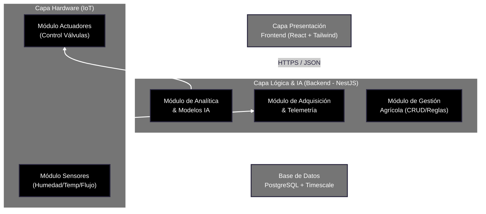

# Arquitectura de software

## Justificación

### Arquitectura: Modelo de tres capas e IoT (Hardware, Backend/IA y Presentación)
Elegimos un modelo arquitectónico de tres capas adaptado a entornos IoT. Este esquema separa la adquisición física de datos en terreno, el procesamiento inteligente en el servidor y la interacción con el usuario final. Esta decisión se fundamenta firmemente en los requisitos extrafuncionales de **Prioridad Alta** seleccionados para el éxito del proyecto agrícola EcoSystems:

#### Mantenibilidad (Requisito de Prioridad Alta)
Dado que el proyecto integra componentes de hardware (Arduino/Sensores) y algoritmos de IA predictiva que del mismo modo van a evolucionar constantemente, la arquitectura modular en el backend separa de forma estricta la recepción de datos crudos de las reglas de negocio y los modelos matemáticos. Esto permite que el equipo de desarrollo pueda refinar la precisión de la IA o cambiar componentes de hardware sin alterar la estabilidad del código base ni congelar la aplicación.

#### Portabilidad (Requisito de Prioridad Alta)
El sistema exige funcionar en múltiples entornos de forma nativa. La capa de hardware corre localmente sobre microcontroladores embebidos en el campo de cultivo, la capa lógica corre de manera centralizada en un servidor en la nube para procesar de forma masiva las predicciones, y la capa de presentación (React) permite que el agricultor visualice el dashboard cómodamente desde su computadora de escritorio o mediante un navegador en su dispositivo móvil mientras recorre el huerto.

#### Testabilidad (Requisito de Prioridad Alta)
Al automatizar recursos críticos como el agua y la salud de las plantas, no podemos permitirnos comportamientos inesperados en las válvulas. La separación modular permite realizar pruebas de software independientes: simular entradas de telemetría falsas para validar el backend (Mocking), probar el comportamiento aislado del modelo de inteligencia artificial y verificar de forma controlada las respuestas de los actuadores mediante una canalización automatizada (CI/CD).

---

## Definición de Módulos

### Módulo de Adquisición & Telemetría
#### Responsabilidad:
- Recepción, filtrado y almacenamiento asíncrono de las ráfagas de datos provenientes de la red de sensores.
- Validación de que los paquetes de datos no vengan corruptos o con lecturas fuera del rango físico (ruido del sensor).
- Transmisión inmediata de alertas al módulo de gestión si se detectan umbrales extremos (ej: sequía absoluta o fuga de agua masiva).

#### Datos que maneja:
- SENSOR: id, tipo_sensor (humedad, temperatura, flujo), modelo_hardware, estado_operativo.
- LECTURA_TELEMETRIA: id, id_sensor, valor_humedad, valor_temperatura, valor_flujo, fecha_hora.
- GATEWAY_CONFIG: puerto_escucha, protocolo_activo (MQTT/HTTP), frecuencia_muestreo.

#### Interacción con otros módulos:
- **Con Analítica & Modelos IA:** Provee el flujo constante de datos históricos limpios para re-entrenar y nutrir las predicciones del modelo hídrico.
- **Con Gestión Agrícola:** Almacena las lecturas asociadas a un sector del campo específico para que el frontend pueda graficarlas.

### Módulo de Analítica & Modelos IA
#### Responsabilidad:
- Procesamiento de algoritmos de inteligencia artificial para predecir las necesidades de riego a corto y mediano plazo.
- Consumo e integración de APIs climatológicas externas para contrastar los datos de los sensores con el pronóstico del tiempo real.
- Cálculo predictivo del consumo óptimo de agua y estimación de costos económicos (Proyecciones Financieras) del periodo en curso.

#### Datos que maneja:
- MODELO_IA: id, version_modelo, precision_metrica, tipo_algoritmo.
- PREDICCION_RIEGO: id, litros_agua_sugeridos, duracion_riego_minutos, fecha_proyeccion.
- PROYECCION_FINANCIERA: id, costo_agua_estimado, consumo_proyectado_mes, periodo_mes.

#### Interacción con otros módulos:
- **Con Capa Hardware (Actuadores):** Envía las órdenes directas de apertura o cierre a las válvulas automatizadas tras procesar si las variables de humedad e IA así lo determinan.
- **Con Gestión Agrícola:** Publica los resultados de los análisis financieros y climáticos para actualizar el panel de control del usuario.

### Módulo de Gestión Agrícola
#### Responsabilidad:
- Autenticación, control de perfiles y roles de los usuarios (Administrador del campo, Ingeniero Agrónomo o Agricultor de terreno).
- Gestión del inventario físico de las zonas de cultivo, sectores del huerto y mapeo de las válvulas asociadas.
- Configuración manual de reglas de negocio prioritarias por sobre la IA (ej: forzar apagado de válvulas o configurar riego en horarios específicos).

#### Datos que maneja:
- USUARIO: id, nombre, email, password (hash), rol.
- CAMPO_CULTIVO: id, nombre_sector, ubicacion_region, tipo_siembra, tamano_hectareas.
- VALVULA_RIEGO: id, id_campo, nombre_valvula, esta_abierta (booleano).
- REGLA_NEGOCIO: id, id_campo, umbral_humedad_minimo, horario_riego_permitido.

#### Interacción con otros módulos:
- **Con Adquisición & Telemetría:** Consulta las lecturas actuales de humedad y temperatura de las últimas horas para alimentar el dashboard principal.
- **Con Capa Presentación (Frontend):** Expone todas las APIs REST/JSON necesarias para renderizar mapas del campo, activar botones manuales de riego y mostrar reportes financieros.
