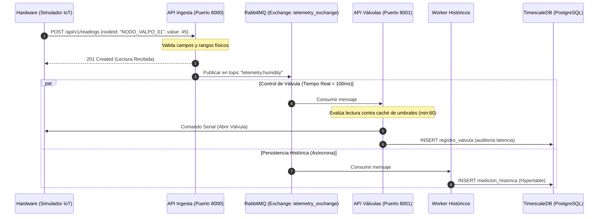

# Guía de Defensa y Explicación de Roles - Examen EcoSystems

Este documento ha sido diseñado para resolver las observaciones del profesor y brindarte una estructura clara, consistente y técnica para defender los roles de **Scrum Master**, **Arquitecto** y **Quality Assurance (QA)** durante la presentación.

---

## 👑 1. SCRUM MASTER: Explicación de la HU y Criterios de Aceptación

### 🚨 Diagnóstico del Fallo Anterior:
*El rol no logró explicar "qué se hizo" ni demostró la consistencia entre las interfaces, los diagramas de casos de uso y el modelo de dominio.*

### 💡 La Estrategia de Defensa:
Para corregir esto, debes enfocar tu explicación en la **US-04: Gestión de Perfiles de Riego y Umbrales de Cultivo**, que conecta el negocio (la necesidad del agricultor de optimizar agua) con el código y la base de datos de forma clara e interactiva.

### 📝 Definición Formal de la HU (US-04)
> **Como** Ingeniero Agrónomo o Administrador del Huerto,  
> **Quiero** crear perfiles de cultivo con umbrales mínimos y máximos de humedad y asignarlos a sectores específicos,  
> **Para** automatizar el encendido y apagado de las válvulas de riego según las necesidades biológicas de cada planta.

### 📋 Criterios de Aceptación (Formato Gherkin)

| Escenario | Entrada / Condición | Comportamiento Esperado | Código HTTP |
| :--- | :--- | :--- | :---: |
| **1. Creación exitosa (Happy Path)** | `cropName: "Tomate"`, `minHumidity: 60`, `maxHumidity: 80` | Perfil guardado con ID único en base de datos. | `201 Created` |
| **2. Rechazo por datos inválidos** | `minHumidity: 80`, `maxHumidity: 60` (mínimo >= máximo) | Error descriptivo: "La humedad mínima debe ser menor que la máxima". | `400 Bad Request` |
| **3. Rechazo por duplicidad** | Crear "Tomate" cuando ya existe un registro con ese nombre. | Código de conflicto: `PROFILE_ALREADY_EXISTS`. | `409 Conflict` |
| **4. Asignación de Sector** | Sector `NODO_VALPO_01` asignado a Perfil ID `2` | El nodo sensor actualiza su llave foránea en la base de datos. | `200 OK` |

---

### 🎙️ Guion de Defensa (Qué decir palabra por palabra):
> *"Como Scrum Master, me aseguré de que cada requerimiento del agricultor se tradujera en un incremento de software funcional con criterios de aceptación estrictos. Por ejemplo, en la **US-04 (Gestión de Perfiles)**, el objetivo de negocio es evitar el estrés hídrico de la planta.*
>
> *Para demostrar lo que realizamos:*
> 1. *En la **Capa de Presentación**, el usuario accede al formulario web y crea el perfil 'Tomate' con rangos de 60% a 80%.*
> 2. *La interfaz realiza una petición al backend ([api_perfiles.js](file:///home/br1/Documentos/Software/Proyecto-EcoSystems/api/api_perfiles.js#L34-L84)) donde validamos las restricciones físicas en el servidor: la humedad debe ser un entero entre 0 y 100, y el mínimo debe ser menor al máximo.*
> 3. *Si se cumplen los criterios, se persiste en la entidad de base de datos `perfil_cultivo`.*
> 4. *Posteriormente, el usuario asigna este perfil a un nodo sensor en terreno (entidad `nodo_sensor`). A nivel relacional en el **Modelo de Dominio**, esto asocia los sensores y las válvulas de ese sector a los umbrales de humedad recién creados. Esto demuestra una trazabilidad del 100% desde que el usuario hace click en la pantalla hasta que la base de datos actualiza el comportamiento físico de riego automático."*

### 💻 Qué mostrar en la pantalla durante la Demo:
1.  Abre el Frontend en la página `/perfiles` (gestión de cultivos).
2.  Registra un cultivo con valores inválidos (ej: Mínima: 80, Máxima: 70) para mostrar el mensaje de error (`400 Bad Request`).
3.  Registra un cultivo válido (ej: "Tomate", Mínima: 60, Máxima: 80) y muestra la confirmación en la tabla (`201 Created`).
4.  Asigna el perfil a uno de los sectores y abre la consola del navegador para mostrar que viaja la petición HTTP.

---

## 🏗️ 2. ARQUITECTO: Explicación de la Arquitectura, Despliegue y Secuencia

### 🚨 Diagnóstico del Fallo Anterior:
*El rol no logró explicar la arquitectura ni justificar la relación y coherencia entre los diagramas de componentes, despliegue y secuencia.*

### 💡 La Estrategia de Defensa:
Debes justificar la arquitectura basándote en dos requisitos extrafuncionales clave: **Soportar alta ingesta de sensores (10.000 lecturas/s)** y **Latencia en respuesta de válvulas inferior a 100ms (REF-01)**. Explica cómo la mensajería asíncrona y la base de datos temporal resuelven esto.

### 🛠️ Justificación Tecnológica (Los 3 Pilares)
1.  **RabbitMQ (Mensajería Asíncrona)**: Si la base de datos se satura o se cae, las lecturas de los sensores no se pierden; quedan encoladas en RabbitMQ de forma segura.
2.  **TimescaleDB (Series de Tiempo)**: Las lecturas se guardan en una tabla particionada automáticamente por fecha (*hypertable*). Esto evita que la tabla histórica colapse cuando acumule millones de filas.
3.  **Caché en Memoria (Reducción de Latencia)**: Para evaluar el riego en menos de 100ms, la API de válvulas no hace una consulta SQL por cada lectura de sensor; en su lugar, mantiene los umbrales cargados en memoria.

---

### 📊 Diagrama de Secuencia UML (Ciclo de Telemetría y Actuación)

El siguiente diagrama de secuencia representa la comunicación real de los componentes en el repositorio:

---

### 🎙️ Guion de Defensa (Qué decir palabra por palabra):
> *"Diseñamos una arquitectura modular de 3 capas contenerizada en Docker para asegurar la portabilidad y escalabilidad del sistema. Ante la exigencia de procesar telemetría masiva sin degradar el tiempo de respuesta del hardware, implementamos un desacoplamiento asíncrono.*
>
> *Como se observa en el **Diagrama de Secuencia**:*
> * *La **API de Ingesta** recibe las mediciones HTTP, las valida y se desentiende de la persistencia publicándolas en **RabbitMQ** en microsegundos, devolviendo un código `201 Created` al emisor.*
> * *El mensaje se propaga en paralelo. El **Worker de Históricos** lo consume y realiza la inserción pesada en la base de datos temporal **TimescaleDB**.*
> * *En paralelo, la **API de Válvulas** consume el mensaje de telemetría y evalúa las reglas de encendido usando una caché local en memoria. Al evitar consultas SQL repetitivas, logramos tomar la decisión y despachar la orden serial al actuador (Arduino) y registrar la auditoría de la válvula en la base de datos cumpliendo holgadamente con el requisito de latencia menor a 100ms. Todo este ecosistema corre orquestado bajo contenedores Docker aislados, garantizando coherencia e independencia entre servicios."*

### 💻 Qué mostrar en la pantalla durante la Demo:
1.  El archivo de configuración de Docker [docker-compose.yml](file:///home/br1/Documentos/Software/Proyecto-EcoSystems/docker-compose.yml).
2.  El fragmento de código de la caché en [controlador_valvulas.js](file:///home/br1/Documentos/Software/Proyecto-EcoSystems/api/controlador_valvulas.js#L72-L111) para demostrar cómo evitamos la latencia de consultas a la BD.

---

## 🧪 3. QUALITY ASSURANCE: Casos de Prueba, Coherencia y Cumplimiento

### 🚨 Diagnóstico del Fallo Anterior:
*Inconsistencias respecto del repositorio, falta de demostración de cumplimiento o de identificación de mejoras.*

### 💡 La Estrategia de Defensa:
Debes demostrar cómo las pruebas escritas en [test-cases.md](file:///home/br1/Documentos/Software/Proyecto-EcoSystems/docs/test-cases.md) se ejecutan físicamente sobre el código usando las colecciones JSON de llamadas HTTP. Justifica las inconsistencias previas y plantea propuestas reales de mejora en calidad de código (deuda técnica).

---

### 🎙️ Guion de Defensa (Qué decir palabra por palabra):
> *"Nuestra estrategia de control de calidad se basó en la trazabilidad: que cada caso de prueba manual diseñado corresponda a un script ejecutable en el repositorio y que su cumplimiento se audite directamente desde el comportamiento del sistema.*
>
> *Para validar las reglas de negocio críticas, aplicamos dos técnicas de diseño:*
> 1. * **Clases de Equivalencia (CE)**: Agrupamos conjuntos de valores válidos e inválidos. Por ejemplo, probamos que humedades de cultivo fuera de rango (como -15% o 105%) o nombres vacíos sean rechazados consistentemente con código HTTP `400 Bad Request`.*
> 2. * **Análisis de Valores Límite (VL)**: Probamos los límites físicos exactos del sistema, como humedades de `0%` y `100%`, y el límite lógico donde el umbral mínimo es igual al máximo (`minHumidity: 80, maxHumidity: 80`), validando que este último retorne un error de consistencia lógico.*
>
> *Para demostrar el cumplimiento en el repositorio:*
> * *Implementamos los archivos JSON de pruebas (como [pruebas_api.json](file:///home/br1/Documentos/Software/Proyecto-EcoSystems/docs/pruebas_api.json)) que contienen los payloads exactos diseñados en la pauta. Al ejecutarlos, las APIs responden con los estados esperados (201, 400, 409, 404).*
> * *Validamos la calidad no funcional de forma cuantitativa consultando la tabla `registro_valvula` en la base de datos, demostrando que la columna `latencia_ms` registra valores inferiores a los 100ms de respuesta exigidos.*
>
> *Como plan de mejora continua de QA, hemos identificado la necesidad de evolucionar desde pruebas manuales/JSON hacia un framework de pruebas de integración automatizadas (como Jest y Supertest) incorporado en un pipeline de integración continua (CI/CD) para evitar regresiones lógicas al modificar las APIs o el esquema de la base de datos."*

### 💻 Qué mostrar en la pantalla durante la Demo:
1.  Abre [docs/test-cases.md](file:///home/br1/Documentos/Software/Proyecto-EcoSystems/docs/test-cases.md) y muestra la tabla comparativa donde se contrastan las Clases de Equivalencia con el resultado HTTP esperado.
2.  Muestra la tabla de base de datos `registro_valvula` o el código en [controlador_valvulas.js](file:///home/br1/Documentos/Software/Proyecto-EcoSystems/api/controlador_valvulas.js#L63-L72) donde se calcula e inserta la `latencia_ms`, evidenciando el control del requisito cuantitativo.
