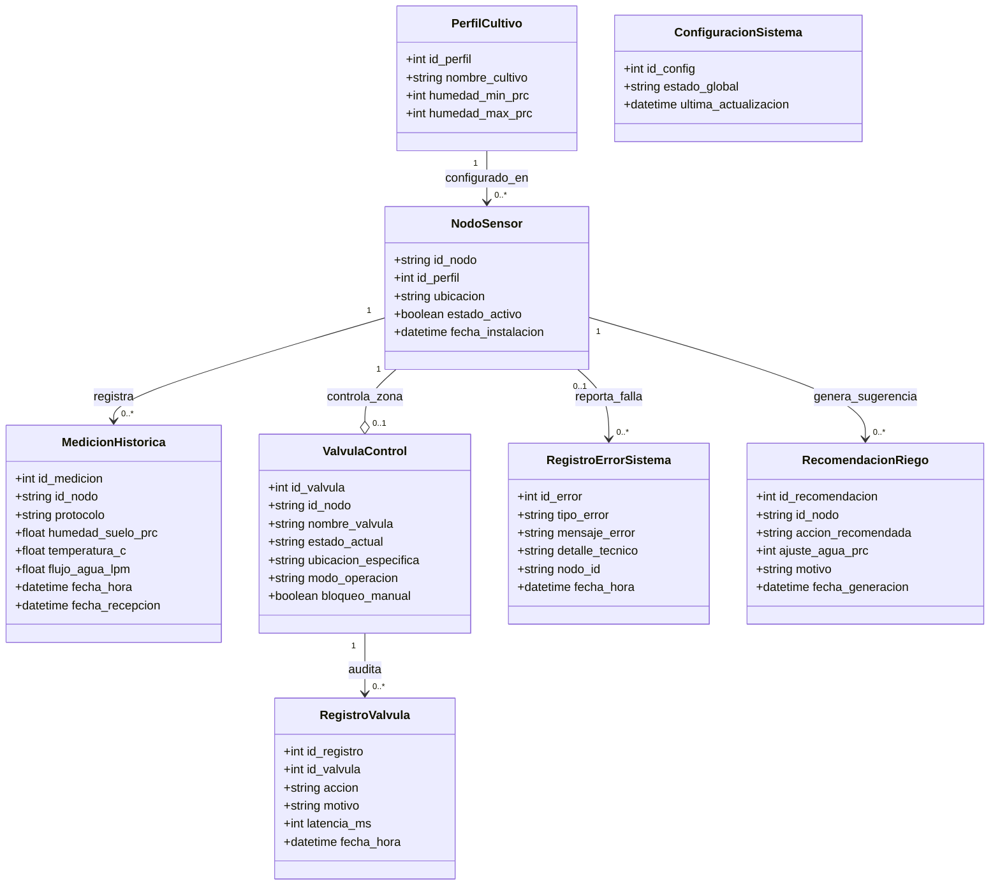

# Modelo de Dominio - EcoSystems

Este documento contiene el modelo de dominio físico e implementado del proyecto **EcoSystems**. Se alinea de forma estricta con el esquema de base de datos relacional y de series de tiempo ([01_schema.sql](file:///home/br1/Documentos/Software/Proyecto-EcoSystems/database/01_schema.sql)) para garantizar la consistencia entre el diseño de software y el código de producción.

---

## 1. Diagrama de Entidades del Dominio (Mermaid)

El siguiente diagrama detalla las clases de negocio, sus atributos reales de persistencia y sus cardinalidades de relación lógica:

---

## 2. Detalle de Entidades e Implementación Física

A continuación se describen las entidades de negocio implementadas en la base de datos de producción:

| Clase del Dominio | Tabla en PostgreSQL | Descripción de Responsabilidad |
| :--- | :--- | :--- |
| **PerfilCultivo** | `perfil_cultivo` | Almacena los rangos biológicos (humedad mínima y máxima) requeridos para el control de riego automático según el tipo de cultivo (ej. Palto, Tomate). |
| **NodoSensor** | `nodo_sensor` | Representa un microcontrolador físico (Arduino/IoT) instalado en el huerto. Vincula la zona de terreno física con un perfil de cultivo específico. |
| **MedicionHistorica** | `medicion_historica` | Entidad de series de tiempo. Registra las lecturas continuas enviadas por los sensores (humedad, temperatura, flujo). Está optimizada como *Hypertable* en TimescaleDB. |
| **ValvulaControl** | `valvula_control` | Representa un actuador electromecánico (válvula de riego) encargado de cortar o habilitar el paso de agua en la zona asociada a un NodoSensor. |
| **RegistroValvula** | `registro_valvula` | Log de auditoría. Guarda cada apertura y cierre de válvula, justificando si fue un trigger automático o manual, e incluye la latencia para validar el cumplimiento del tiempo real. |
| **RegistroErrorSistema**| `registro_error_sistema` | Centraliza el registro de alertas y fallos técnicos (caídas de red, fallos del microcontrolador o de consultas BD) para facilitar la labor de soporte. |
| **RecomendacionRiego** | `recomendacion_riego` | Entidad generada por el módulo de analítica que entrega alertas predictivas o sugerencias de ajuste de agua según el clima e históricos. |
| **ConfiguracionSistema**| `configuracion_sistema` | Singleton de configuración global que permite, por ejemplo, activar una parada de emergencia global para congelar todas las decisiones automatizadas de las válvulas. |

---

## 3. Relaciones del Dominio

*   **`PerfilCultivo (1) -> (0..*) NodoSensor`**: Un perfil de umbrales hídricos puede aplicarse a múltiples nodos sensores distribuidos en el campo, pero cada nodo sensor responde solo a un perfil de cultivo a la vez.
*   **`NodoSensor (1) -> (0..*) MedicionHistorica`**: Un nodo sensor genera un flujo continuo e infinito de telemetría a lo largo del tiempo.
*   **`NodoSensor (1) -> (0..1) ValvulaControl`**: Una zona física es monitoreada por un nodo de sensores y regada por una válvula asociada. Se define como opcional (`0..1`) dado que un sector podría tener sensores pero no contar con válvulas automatizadas de riego aún.
*   **`ValvulaControl (1) -> (0..*) RegistroValvula`**: Cada acción física de apertura o cierre es registrada para auditorías operacionales e hídricas.
*   **`NodoSensor (1) -> (0..*) RecomendacionRiego`**: El análisis histórico y predictivo genera recomendaciones de riego específicas por nodo sensor.
*   **`NodoSensor (0..1) -> (0..*) RegistroErrorSistema`**: Las fallas de hardware en terreno se asocian al nodo sensor correspondiente para su rápida identificación y reemplazo físico.

---

## 4. Nota sobre Entidades Administrativas y de Negocio General

En versiones tempranas de diseño conceptual se modelaron entidades como **`Usuario`** (Administrador, Agrónomo) y **`CampoCultivo`** (Hectáreas, Sectores). 
*   **Decisión de Diseño**: Para asegurar la consistencia absoluta con el código desarrollado en este ciclo, estas entidades **no se crearon físicamente en el esquema de base de datos** (`01_schema.sql`). 
*   Para la entrega actual, la autenticación y distribución geográfica se manejan a nivel de interfaz de usuario de Next.js (mockeadas) o se asocian de forma lógica en la ubicación textual del sensor, permitiendo enfocar los recursos de computación y base de datos en la alta ingesta de datos IoT y la rapidez de respuesta del riego hídrico.
