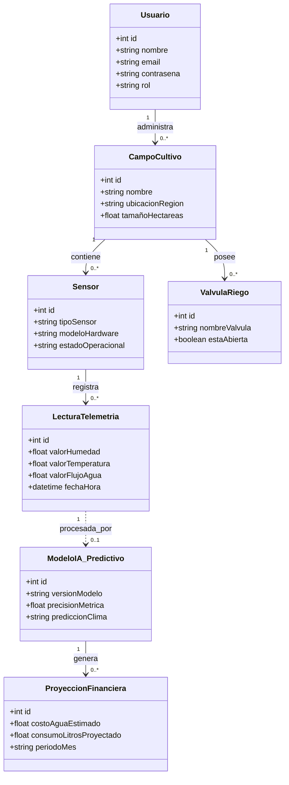

# Entidades del Dominio

## Modelo de Dominio General - EcoSystems

## Detalle de Entidades y sus Atributos

| Entidades y sus atributos |
| :--- |
| **Usuario** → id, nombre, email, contraseña, rol *(ej: Administrador, Encargado del Huerto)* |
| **CampoCultivo** → id, nombre, ubicacionRegion, tamañoHectareas |
| **Sensor** → id, tipoSensor *(ej: Humedad, Temperatura, Flujo)*, modeloHardware *(ej: Arduino Uno v3)*, estadoOperacional |
| **LecturaTelemetria** → id, valorHumedad, valorTemperatura, valorFlujoAgua, fechaHora |
| **ValvulaRiego** → id, nombreValvula, estaAbierta *(Estado de automatización)* |
| **ModeloIA_Predictivo** → id, versionModelo, precisionMetrica, prediccionClima *(Datos procesados de IA)* |
| **ProyeccionFinanciera** → id, costoAguaEstimado, consumoLitrosProyectado, periodoMes |

---

## Relaciones del Sistema

| Relación | Descripción |
| :--- | :--- |
| **Usuario `1 ——< 0..*` CampoCultivo** | Un usuario administrador o agricultor puede estar a cargo de uno o múltiples sectores o campos de cultivo. |
| **CampoCultivo `1 ——< 0..*` Sensor** | Cada zona del huerto contiene múltiples sensores distribuidos para recolectar métricas del suelo. |
| **CampoCultivo `1 ——< 0..*` ValvulaRiego** | Cada sector agrícola posee sus propias válvulas físicas acopladas para controlar el flujo de agua. |
| **Sensor `1 ——< 0..*` LecturaTelemetria** | Un dispositivo sensor registra un histórico constante de lecturas climáticas y de humedad en el tiempo. |
| **LecturaTelemetria `1 ..> 0..1` ModeloIA_Predictivo** | Las métricas del campo alimentan al modelo de Inteligencia Artificial para que analice las condiciones de riego. |
| **ModeloIA_Predictivo `1 ——< 0..*` ProyeccionFinanciera** | El cerebro analítico calcula las estimaciones de consumo y costos monetarios correspondientes al periodo agrícola. |
